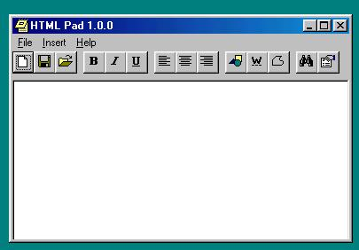



## HTML Pad

### Description

This is a HTML editor for windows. Sort of like an notepad enhancement for web page designers. I made this for a friend of mine and it is still in the development process. Tell me what you think and and also let me know as to how I can improve / upgrade it.
 
### More Info
 

             |
---                |---
**Submitted On**   |2000-12-20 10:30:20
**By**             |[Mahangu](https://github.com/Planet-Source-Code/PSCIndex/blob/master/ByAuthor/mahangu.md)
**Level**          |Beginner
**User Rating**    |4.5 (18 globes from 4 users)
**Compatibility**  |VB 6\.0
**Category**       |[Internet/ HTML](https://github.com/Planet-Source-Code/PSCIndex/blob/master/ByCategory/internet-html__1-34.md)
**World**          |[Visual Basic](https://github.com/Planet-Source-Code/PSCIndex/blob/master/ByWorld/visual-basic.md)
**Archive File**   |[CODE\_UPLOAD1291912212000\.zip](https://github.com/Planet-Source-Code/mahangu-html-pad__1-13775/archive/master.zip)

